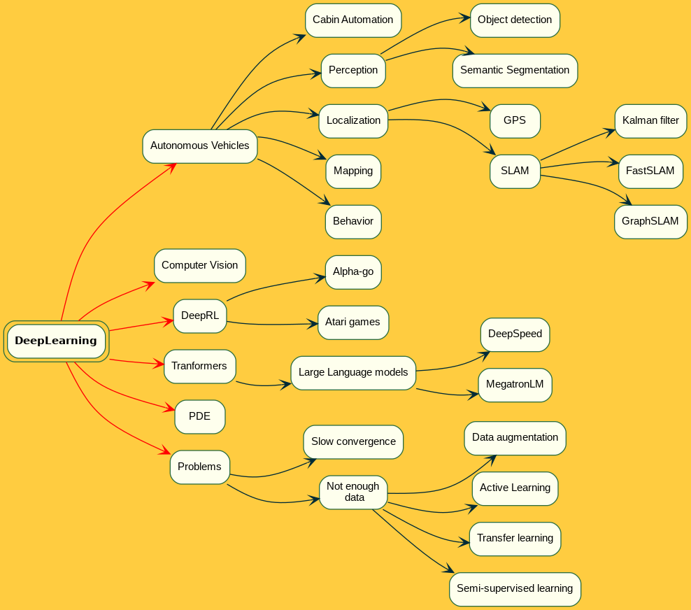

# MindMap
Application to graphical MindMaps  from descriptions written in org-mode inspired syntax. The following sample mindmpap



is generated from this mindmap definition

```markdown
* DeepLearning
** Autonomous Vehicles
*** Cabin Automation
*** Perception
**** Object detection
**** Semantic Segmentation
*** Localization
**** GPS
**** SLAM
***** Kalman filter
***** FastSLAM
***** GraphSLAM
*** Mapping
*** Behavior
** "Computer Vision"
** "DeepRL"
*** "Alpha-go"
*** "Atari games"
** "Tranformers"
*** "Large Language models"
**** DeepSpeed
**** MegatronLM
** PDE
** Problems
*** "Slow convergence"
*** "Not enough\n data"
**** Data augmentation
**** Active Learning
**** Transfer learning
**** "Semi-supervised learning"
```

# Features

* Read org-syntax
* Output png
* Nodes have shape, color
* Edges have line style, color
* Generate debian package
* Publish to conda
* Publish to lauchpad via ppa

# Build

## Requirements

* CMake-3.2
* graphviz-2.40
* gtest-1.10
* flex-2.6.4
* bison-3.7.4


A fully function build environment can be built using Conda and the provided ```dev.yml``` Conda environment definition file:

```shell
conda create -f=dev.yml
```

## How to build

Execute the following commands on the package root folder (the one that contains this README.md file):

```shell
rm -rf build
mkdir build
cd build
cmake .. -DCMAKE_BUILD_TYPE=Release
make -j
```

Run the tests:

```shell
make test
```

Generate a debian package:

```shell
make package
```

## Build options

* BUILD_TEST: Default ON. Build tests?

For instace, to not build the tests:

```shell
cmake .. -DBUILD_TESTS=OFF -DCMAKE_BUILD_TYPE=Release
```
