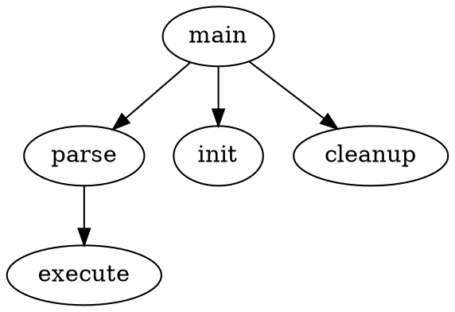

# In-memory representation

```C
MindMap {
    Node* root;
}

Node {
    int level;
    char* content;
    char** children;
    int nchildren;
}
```

# Target format

Here is an example of the target format. The firts iteration won't include any style information. For an input like the following

```dot
* main
** parse
*** execute
** init
** cleanup
```

A valid dot file woudl be:



So a simple strategy for translating could be

* Write header
* Write out each node in a line -> doing a simple traversal
* Write out each parent-child edge -> doing a simple traversal

Another alternative, to produce a more compact output, euqualy dot valid:

* Write out each parent-child edge -> Doing a simple traversal. Graphviz adds nodes that appear for the first time in an edge representation, so we can save the need to pre-declare all the nodes. <- **This is the one I am going to prototype**.
